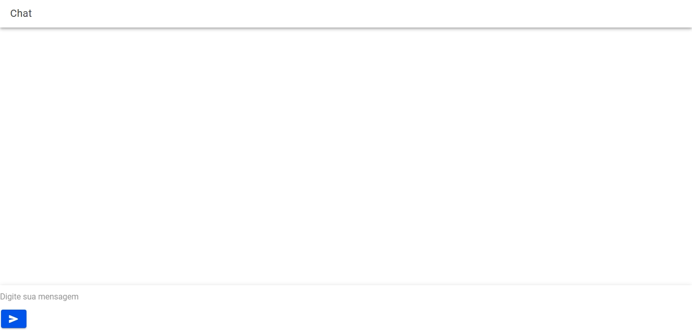

# 🌐 Chatbot Inteligente com Ionic + Rasa  
### Um Frontend Moderno e um Backend Baseado em IA Conversacional

---

## ✨ Visão Geral

Este projeto apresenta um **frontend desenvolvido em Ionic/Angular** que se comunica com um **modelo conversacional Rasa**, criando uma interface moderna, responsiva e pronta para ser usada em aplicações reais de suporte ao usuário.

O backend Rasa utilizado está disponível no repositório:

➡️ **https://github.com/DomingosGnd/rasa-chatbot-model**

---

## 🎨 Design da Interface (UI/UX)

A interface foi desenvolvida com foco em:

- Simplicidade  
- Navegação fluida  
- Ambiente agradável de conversa  
- Experiência semelhante a apps modernos de chat  


---

## 📱 Estrutura das Telas

### 🟦 Welcome Page
- Tela inicial de boas-vindas  
- Botões de Login e Registrar  


---


### 🏠 Home Page
- Tela principal após login  
- Menu e navegação  
- Acesso ao chat  


---

### 💬 Chat Page
- Interface de chat estilo Messenger  
- Envio e recepção de mensagens via API Rasa  




---

## 🔗 Comunicação com o Backend Rasa

A comunicação é feita via:

```
POST http://localhost:5005/webhooks/rest/webhook
```

Exemplo de requisição:

```ts
sendMessage(message: string) {
  return this.http.post('http://localhost:5005/webhooks/rest/webhook', {
    sender: 'user',
    message: message
  });
}
```

---

## 🚀 Como Rodar o Projeto

### 1️⃣ Instalar dependências
```
npm install
```

### 2️⃣ Rodar o servidor Ionic
```
ionic serve
```

### 3️⃣ Rodar o backend Rasa
No diretório do Rasa:

```
rasa run --enable-api --cors "*"
```

---

## 📂 Estrutura do Projeto

```
src/
 ├─ app/
 │   ├─ pages/
 │   │    ├─ welcome/
 │   │    ├─ login/
 │   │    ├─ register/
 │   │    └─ chat/
 │   └─ home/
 └─ assets/
      └─ images/
```

---

## 🛠️ Tecnologias Usadas

- **Ionic 7 + Angular**
- **Rasa 3.x**
- **TypeScript**
- **HTML e SCSS**
- **API REST**

---

## 🤝 Contribuições

Sinta-se à vontade para enviar PRs, melhorias, issues ou sugestões!  
Este projeto faz parte do desenvolvimento de uma aplicação de apoio conversacional.

---

## 👤 Autor

**Domingos Bié**  
Desenvolvedor | IA | Chatbots | Mobile  
GitHub: https://github.com/DomingosGnd

---

## 📝 Licença

Este projeto é distribuído sob a licença **MIT**.

---

